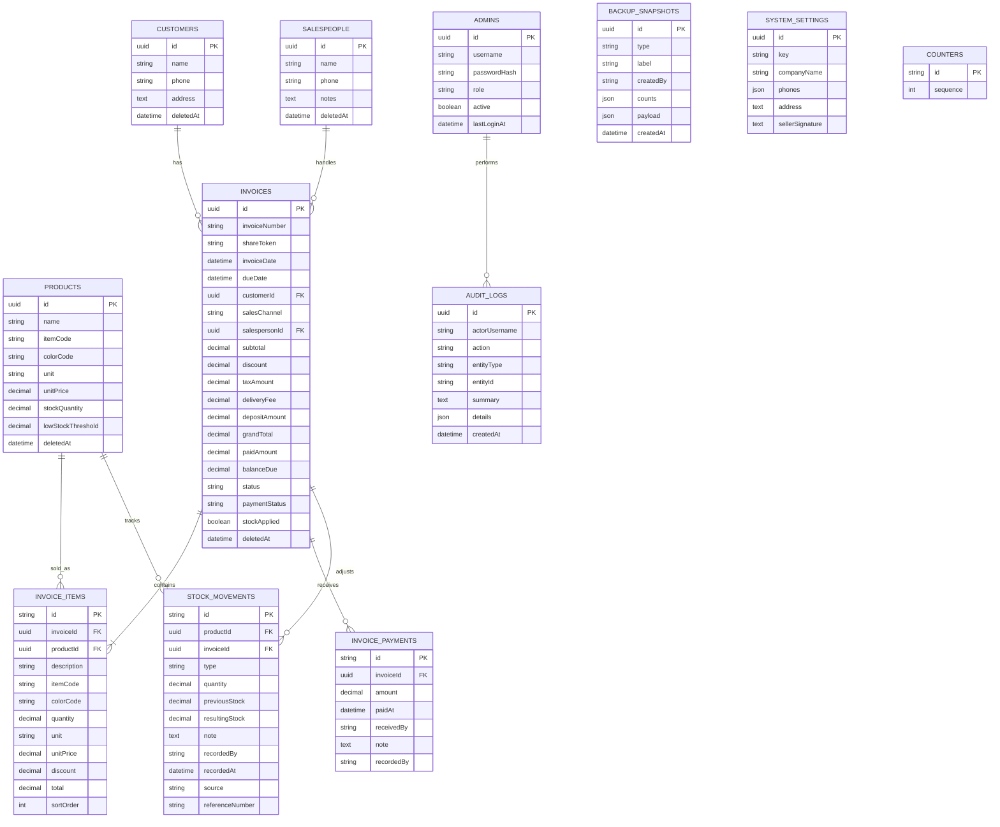

# ER Diagram - Jotun Billing System

## Normalized Design

ក្នុង project នេះ `invoice_items`, `invoice_payments`, និង `stock_movements`
ត្រូវបានបំបែកជា tables ដាច់ដោយឡែក ដើម្បីបង្ហាញ normalized relational design
សម្រាប់ MySQL/Sequelize។ JSON fields នៅក្នុង `invoices` និង `products` ត្រូវបានរក្សាទុក
សម្រាប់ backward compatibility និង backup migration ប៉ុន្តែ tables ខាងក្រោមគឺជារចនាសម្ព័ន្ធសំខាន់សម្រាប់សារណា។

## Key Rules

- `invoices.invoiceNumber` មាន unique sequence ជា `INV-YYYY-00001`។
- `invoice_items.invoiceId` ជា foreign key ទៅ `invoices.id` ហើយលុបតាម invoice។
- `invoice_payments.invoiceId` ជា foreign key ទៅ `invoices.id` សម្រាប់ payment history។
- `stock_movements.productId` ជា foreign key ទៅ `products.id` សម្រាប់ stock audit trail។
- `stock_movements.invoiceId` ត្រូវបានប្រើពេល stock កាត់/សងវិញដោយសារ invoice។
- `invoices.stockApplied` ការពារ stock មិនឲ្យកាត់ស្ទួនពេល invoice ត្រូវបាន update។
